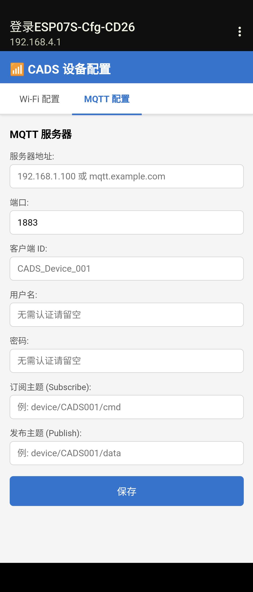
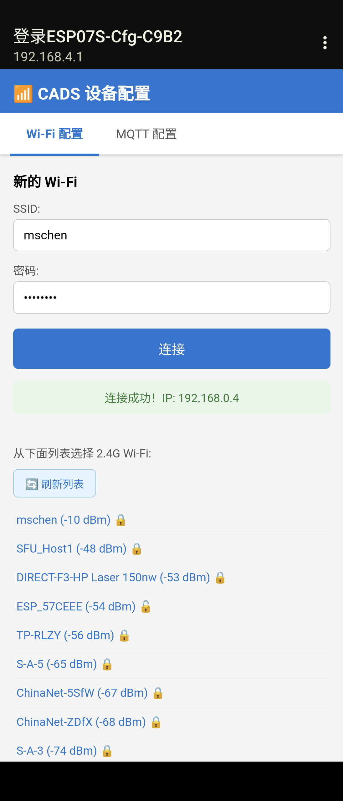

# ESP07S_AP_WiFi_Firmware

**ESP07S_AP_WiFi_Firmware** 是全网第一个实现 ESP-07S 型号下，完美适配兼容 AP 模式配网和 MQTT 配网的固件包。

专为 **ESP-07S (ESP8266)** 模组定制，彻底解决了该型号在 AP 配网场景下长期存在的 Task WDT 崩溃、Wi-Fi 扫描列表为空、DHCP 无响应、浏览器断线等顽固问题，并在同一配网页面集成了完整的 MQTT 服务器参数配置能力。


## [最新源码下载](https://shop.unitos.cn/item/18)

---




## 功能特性

| 功能 | 说明 |
|------|------|
| **AP 模式配网** | 扫描周边 2.4G Wi-Fi，手机选择并输入密码一键连接 |
| **实时显示 IP** | 连接成功后浏览器自动轮询并显示获取到的 IP 地址 |
| **MQTT 配置** | 同一页面配置 MQTT 服务器地址、端口、Client ID、用户名、密码、订阅/发布主题 |
| **NVS 持久化** | Wi-Fi 凭据与 MQTT 参数均写入 Flash，掉电不丢失 |
| **自动重连** | 上电后自动从 NVS 读取凭据尝试连接，无需重新配网 |
| **Captive Portal** | Android/iOS 连接热点后自动弹出配网页面 |
| **UART 协议** | STM32 通过简单文本命令控制配网流程，接收连接结果和 MQTT 配置 |
| **Task WDT 完全修复** | 通过三层保护彻底解决 ESP-07S 特有的 WDT 崩溃问题 |

---

## 硬件要求

| 项目 | 要求 |
|------|------|
| 模组 | ESP-07S（ESP8266，4MB Flash） |
| 主控 | STM32（或任意支持 UART 的 MCU） |
| 接线 | ESP TX → MCU RX，ESP RX → MCU TX，共 GND |
| 烧录 | USB-TTL 转接器（CH340 / CP2102），GPIO0 需可接 GND 进入烧录模式 |

---

## UART 通信协议

波特率：**115200 8N1**

### STM32 → ESP（命令）

| 命令 | 说明 |
|------|------|
| `CMD:START_AP` | 启动 AP 配网热点（SSID: `ESP07S-Cfg-XXXX`） |
| `CMD:STOP_AP` | 关闭 AP 及 HTTP 服务器，配网流程结束 |
| `CMD:AUTO_CONNECT` | 从 NVS 读取凭据自动连接，无凭据时回复 `NO_CRED` |
| `CMD:STATUS` | 查询当前状态（返回 `EVT:STATUS,...`） |
| `CMD:CLEAR` | 清除 NVS 中全部 Wi-Fi 凭据 |
| `CMD:RESET` | 软重启 ESP |

每条命令以 `\n` 结尾，ESP 回复 `ACK:OK` 或 `ACK:FAIL`。

### ESP → STM32（事件）

| 事件 | 触发时机 | 示例 |
|------|----------|------|
| `EVT:AP_START,<SSID>` | AP 热点已启动 | `EVT:AP_START,ESP07S-Cfg-C9B2` |
| `EVT:AP_STOP` | AP 已关闭 | `EVT:AP_STOP` |
| `EVT:CLIENT_IN` | 手机连入热点 | `EVT:CLIENT_IN` |
| `EVT:CONNECTING,<SSID>` | 开始连接路由器 | `EVT:CONNECTING,MyWiFi` |
| `EVT:CONNECTED,<SSID>,<IP>` | 连接成功并获取 IP | `EVT:CONNECTED,MyWiFi,192.168.0.4` |
| `EVT:FAILED,<code>` | 连接失败或超时 | `EVT:FAILED,0` |
| `EVT:MQTT_CFG,<host>,<port>,<client_id>,<user>,<sub_topic>,<pub_topic>` | 用户保存 MQTT 配置 | `EVT:MQTT_CFG,broker.emqx.io,1883,esp07s,admin,cmnd/esp,stat/esp` |
| `EVT:STATUS,<state>,<IP>` | 响应 `CMD:STATUS` | `EVT:STATUS,CONNECTED,192.168.0.4` |
| `EVT:NO_CRED` | NVS 无凭据，自动连接失败 | `EVT:NO_CRED` |

---

## 配网页面

手机连入热点后访问 `http://192.168.4.1`，页面包含两个 Tab：

### Wi-Fi 配置 Tab

- 自动加载附近 2.4G Wi-Fi 列表（信号强度排序，有锁标识加密网络）
- 点击网络自动填入 SSID，输入密码后点击**连接**
- 页面实时轮询连接状态，成功后显示 **`连接成功！IP: 192.168.0.x`**
- 连接失败时提示错误并可重试

### MQTT 配置 Tab

| 字段 | 说明 | 默认值 |
|------|------|--------|
| 服务器地址 | MQTT Broker IP 或域名 | — |
| 端口 | MQTT 端口 | 1883 |
| Client ID | 设备标识符 | — |
| 用户名 | Broker 认证用户名 | — |
| 密码 | Broker 认证密码 | — |
| 订阅主题 | 设备接收指令的 Topic | — |
| 发布主题 | 设备上报数据的 Topic | — |

点击**保存**后，参数写入 NVS，ESP 发送 `EVT:MQTT_CFG` 事件通知 STM32。

> **重要**：Wi-Fi 连接成功后 AP 热点**保持存活**，可继续操作 MQTT Tab，直到 STM32 发送 `CMD:STOP_AP` 为止。

---

## 完整配网流程

```
STM32                          ESP07S                        手机浏览器
  |                               |                               |
  |--- CMD:START_AP ------------->|                               |
  |<-- ACK:OK + EVT:AP_START -----|                               |
  |                               |<--- 连接 ESP07S-Cfg-XXXX -----|
  |<-- EVT:CLIENT_IN -------------|                               |
  |                               |<--- GET 192.168.4.1 ----------|
  |                               |---- 配网页面（Wi-Fi Tab） --->|
  |                               |<--- POST /connect（SSID+密码）|
  |<-- EVT:CONNECTING,<SSID> -----|                               |
  |                               |--- GET /result（每秒轮询）--->|
  |<-- EVT:CONNECTED,<SSID>,<IP>--|                               |
  |                               |---- {done:true, ip:"x.x.x.x"}|
  |                               |<--- 切换 MQTT Tab，填写参数 --|
  |                               |<--- POST /mqtt-config --------|
  |<-- EVT:MQTT_CFG,... ----------|                               |
  |                               |---- {success:true} ---------->|
  |--- CMD:STOP_AP -------------->|                               |
  |<-- ACK:OK + EVT:AP_STOP ------|                               |
```

---

## 编译环境配置

### 依赖

| 工具 | 版本 | 说明 |
|------|------|------|
| ESP8266 RTOS SDK | v3.4+ | `D:\ESP8266_RTOS_SDK` |
| Python | 3.x | idf.py 依赖 |
| Ninja | 1.12.1 | 构建工具 |
| xtensa-lx106-elf GCC | 8.4.0 | ESP8266 工具链 |
| PowerShell | 7+ | 构建脚本执行环境 |

### 修改 SDK 路径

打开 `build.ps1`，修改前三行路径变量：

```powershell
$SDK       = "D:\ESP8266_RTOS_SDK"           # ESP8266 RTOS SDK 根目录
$ninjaDir  = "C:\...\ninja\1.12.1"           # Ninja 可执行文件目录
$toolchain = "C:\...\xtensa-lx106-elf\bin"  # GCC 工具链 bin 目录
```

---

## 编译与烧录

### 1. 编译固件

```powershell
cd WiFiManager
.\build.ps1
```

编译成功输出：
```
Project build complete. To flash, run ...
```

固件输出路径：`build\esp07s_wifi_manager.bin`（约 479 KB）

### 2. 进入烧录模式

1. **GPIO0 接 GND**（按住 BOOT 键）
2. 按下 **RST 复位键**（或重新上电）
3. 松开 RST，**保持 GPIO0 接 GND**

### 3. 烧录固件

```powershell
.\build.ps1 flash COM12
```

将 `COM12` 替换为实际串口号（Windows 设备管理器中查看）。

烧录成功输出：
```
Hash of data verified.
Leaving...
Hard resetting via RTS pin...
```

### 4. 清除重新编译（可选）

```powershell
.\build.ps1 clean   # 清除构建缓存
.\build.ps1         # 重新完整编译
```

---

## 快速验证

固件烧录后，用串口助手（115200 8N1）发送：

```
CMD:START_AP
```

预期响应：
```
ACK:OK
EVT:AP_START,ESP07S-Cfg-XXXX
```

手机搜索并连接名为 `ESP07S-Cfg-XXXX` 的 Wi-Fi 热点（无密码），浏览器自动弹出或手动访问 `192.168.4.1`。

---

## 关键技术突破

本固件针对 ESP-07S 型号进行了深度适配，解决以下长期存在的难题：

### 1. Task WDT 崩溃（三层修复）
- **根因**：`esp_wifi_start()` 内部重置混杂回调为 NULL，约 12 秒后 ppTask 调用空指针 → 驱动内部 15 秒等待 → Task WDT 触发
- **修复**：每次 `esp_wifi_start()` 后立即注册空混杂回调；`vApplicationTickHook` 定期喂狗；阻断 OPEN AUTH 下的 PBKDF2 全量计算

### 2. Wi-Fi 扫描列表为空
- **根因**：cJSON 在 Wi-Fi 栈占用大量堆后 `CreateArray()` 返回 NULL，响应 `[]` 且被浏览器缓存
- **修复**：改用直接字符串拼接（零堆分配）；扫描缓存扩大至 4096 字节；添加 `Cache-Control: no-cache`

### 3. 连接后 DHCP 无响应
- **根因**：AP 模式调用 `tcpip_adapter_dhcpc_stop(STA)` 后，切换连接时未重新启动 DHCP 客户端
- **修复**：连接前显式调用 `tcpip_adapter_dhcpc_start(TCPIP_ADAPTER_IF_STA)`

### 4. 浏览器断线看不到 IP
- **根因**：使用 `esp_wifi_stop()` 切模式导致 AP 瞬断，手机 Wi-Fi 断线，浏览器导航到错误页，JavaScript 上下文丢失
- **修复**：改用 `esp_wifi_set_mode(WIFI_MODE_APSTA)` 动态切换，AP 全程不停；增加 `/result` 轮询接口

---

## 项目结构

```
WiFiManager/
├── build.ps1               # 一键编译/烧录脚本
└── main/
    ├── wifi_manager.c/h    # Wi-Fi 状态机、命令处理、UART 事件
    ├── http_server.c/h     # HTTP 服务器、配网页面、REST 接口
    ├── uart_protocol.c/h   # UART 收发协议（115200 8N1）
    ├── dns_server.c/h      # Captive Portal DNS 服务器
    └── CMakeLists.txt
```

---

## License

MIT
